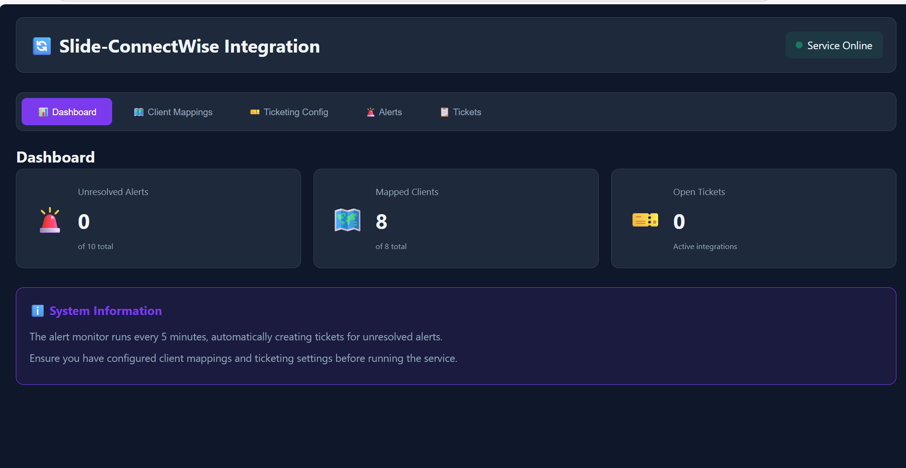
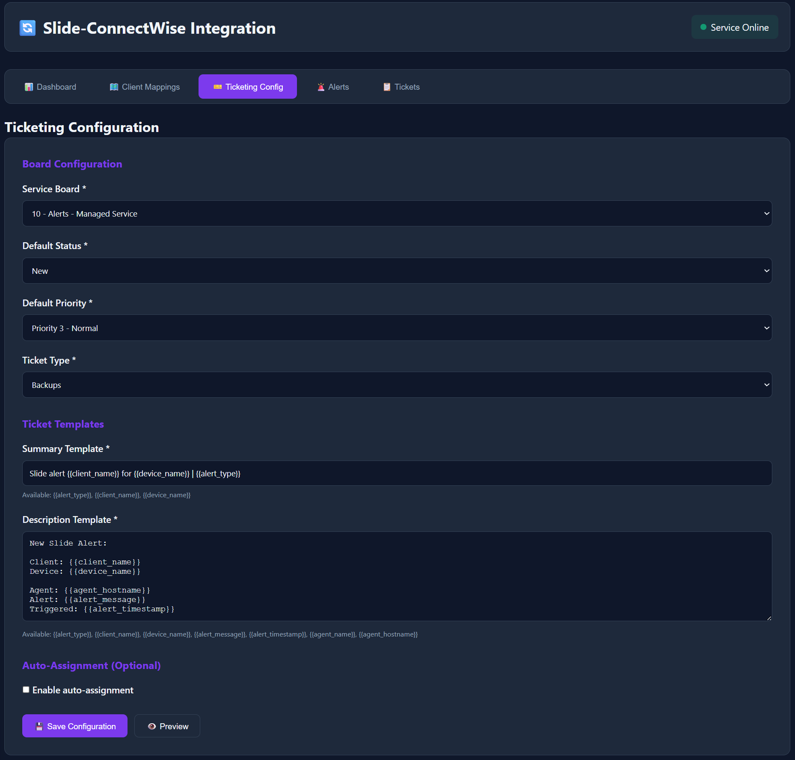
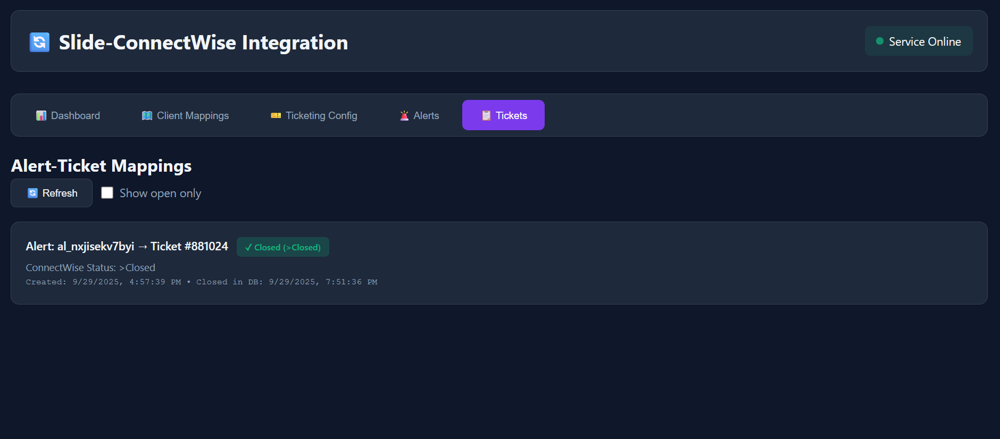

# Slide <-> ConnectWise Integration

**My idea with this project was three-fold**

    First I wanted a slide integration to cw to buy the slide team some time to work on other features, I figured I could build something.

    Second - I kinda like go - well really the cross platform applicability of it, so I set out to build something worthwhile - hopefully it is that.

    Third - If I build it - slide will have to fix it. Cause it wont be good.







#### Code review and enhancements by Claude Sonnet 4.5. I of course did not write this entire readme - actually I didn't write any of the readme or git commit messages (maybe the last 25 edits - turns out I am bad at markdown) I reviewed every line and edited (obviously).

#### What I Used AI for - Code Review & commenting - I tend to write and not know why so I leveraged claude to make some sense, out of my nonsense, troubleshooting, basic web interface creation ( UI is not my thing, weird because I used to be a web developer) - The TUI I had going was kewl - but it didn't work right. I gave in and had claude adapt it to a web ui - it was much faster. 

#### I am just a guy that works at an msp and watches cat videos....

#### CW Client ID is required - if you don't have one - get one at developers.connectwise.com. 

**Automated ticket management for MSPs using slide** - Monitors Slide backup alerts and automatically creates ConnectWise tickets for your clients based on your mappings.

## What Does This Do?

This application bridges **Slide Backup** (Slide.Tech) and **ConnectWise Manage** (PSA) to automate your MSP's backup alert workflow:

1. **Monitors** - Checks Slide API every 5 minutes for backup failures and alerts
2. **Maps** - Matches devices to your ConnectWise client companies
3. **Creates Tickets** - Automatically creates tickets in ConnectWise when issues occur - mapped to the appropriate company
4. **Auto-Closes** - Closes both alerts and tickets when backups succeed again - ie backup failed at 2AM - it will check every 5 minutes to see if the backup endpoint has a successful completion - if it does, close the alert 
5. **Syncs** - Detects manually closed tickets and closes corresponding alerts - this applies cw -> slide and slide -> cw

### Why Use This?

- ✅ **Alerting more in line with MSP Best Practices** - No more checking Slide manually
- ✅ **Automate Ticket Creation** - Save 5-10 minutes per alert - you no longer have to take the email, change the company, type, subtype and item
- ✅ **Bidirectional Sync** - Works whether you close the ticket or fix the backup
- ✅ **Because you should not pay for a backup monitoring tool** - nuff said
- ✅ **Because you want too** - free tools are cool


## Quick Start

### Prerequisites

- Slide API credentials (API URL + API Key)
- ConnectWise Manage API credentials (URL, Company ID, Public Key, Private Key, Client ID)
- **Optional:** Go 1.19+ (only if building from source). Windows binaries available. I guess I could build the others if neeeded... 

### Installation

#### Option 1: Download Pre-built Binary (Windows)

1. **Download the latest release:**
   - Go to the [Releases page](https://github.com/gitglubber/SlideIntoCW/releases/)
   - Download `slide-integrator.exe` for Windows
   - No compilation required!

2. **Create `.env` file** (in same directory as .exe):
   ```bash
   # Slide API
   SLIDE_API_URL=https://api.slide.tech
   SLIDE_API_KEY=your_slide_api_key

   # ConnectWise API
   CONNECTWISE_API_URL=https://na.myconnectwise.net/v4_6_release/apis/3.0 #im in North America (pretty sure you would be too)
   CONNECTWISE_COMPANY_ID=your_company_id # company name
   CONNECTWISE_PUBLIC_KEY=your_public_key # public key
   CONNECTWISE_PRIVATE_KEY=your_private_key # private key
   CONNECTWISE_CLIENT_ID=your_client_id # get from developers.connectwise.com
   ```

3. **Run the application:**
   ```bash
   # With Web UI (recommended) Port 8080 default
   slide-integrator.exe -web

   # With Web UI on custom port
   slide-integrator.exe -web -port 8001

   # Without Web UI (service mode only) Only after mapping and configuring ticket templates (use this for NSSM or just launching the process)
   slide-integrator.exe
   ```

4. **Open browser:**
   - Default: http://localhost:8080
   - Custom port: http://localhost:8001 (or whatever port you specified)

#### Option 2: Build from Source

1. **Clone and build:**
   ```bash
   git clone <your-repo-url>
   cd SlideIntoCW
   go build -o slide-integrator.exe ./cmd/slide-integrator
   ```

2. **Follow steps 2-4 from Option 1 above**

## Setup (First Time)

### Step 1: Map Your Clients

The application needs to know which Slide clients map to which ConnectWise companies.

**Web UI Method (Recommended):**
1. Go to **Client Mappings** tab
2. Click **🤖 Auto-Map Clients** (uses fuzzy name matching)
3. Manually map any that didn't auto-match
4. Click **➕ Map** next to unmapped clients

**CLI Method:**
```bash
./slide-integrator.exe -map-clients      # Auto-map by name similarity
./slide-integrator.exe -show-mappings    # Verify mappings

# Honestly do not use these ^ They are from my original TUI (It was awful...)
```

### Step 2: Configure Ticketing

Tell the app how to create tickets in ConnectWise.

**Web UI (Recommended):**
1. Go to **Ticketing Config** tab
2. Select your **Service Board**
3. Choose default **Status** (e.g., "New")
4. Set **Priority** (e.g., "Medium")
5. Pick **Ticket Type** (e.g., "Issue")
6. Customize templates if desired
7. Click **💾 Save Configuration**

The templates support these variables:
- `{{alert_type}}` - Type of alert
- `{{client_name}}` - ConnectWise company name
- `{{device_name}}` - Device hostname
- `{{alert_message}}` - Error message
- `{{alert_timestamp}}` - When alert occurred
- `{{agent_name}}` - Backup agent name
- `{{agent_hostname}}` - Agent machine name

## Ticket Template ##
    - These are not pre-populated - you will need to fill them out - customize them to your own liking
```
 **Summary Template**: Slide alert {{client_name}} for {{device_name}} | {{alert_type}} 
 
 
**Description Template**: 
New Slide Alert:

Client: {{client_name}}
Device: {{device_name}}

Agent: {{agent_hostname}}
Alert: {{alert_message}}
Triggered: {{alert_timestamp}}
```

### Step 3: Run the Service

```bash
./slide-integrator.exe -web
```

This starts both:
- **Web UI** on http://localhost:8080 (for management)
- **Alert Monitor** running in background (checks every 5 minutes)

## How It Works

### For MSP Multi-Tenant Accounts

If you're an MSP with multiple clients under one Slide account:

1. **Alert arrives** - Slide alert shows your MSP account name (e.g., "Acme Company")
2. **Device lookup** - App looks up which device the alert is for
3. **Smart matching** - Matches device name prefix to client:
   - Device "CTC-S5TB" → "Charlie Tango Company"
   - Device "BM-S3TB" → "Bob Marley"
4. **Client mapping** - Finds ConnectWise company for that client
5. **Ticket creation** - Creates ticket under correct company in CW

### Alert-to-Ticket Lifecycle

```
🚨 Backup Failure Detected
    ↓
🔍 Device → Client Lookup
    ↓
🗺️ Client → ConnectWise Mapping
    ↓
🎫 Ticket Created in ConnectWise
    ↓
⏳ Monitor Every 5 Minutes
    ↓
✅ Resolution (either way):
    • Backup succeeds → Close ticket & alert
    • Ticket closed manually → Close alert
```

## Web UI Features

### 📊 Dashboard
- Real-time statistics
- Unresolved alerts count
- Mapped clients progress
- Open tickets tracking
- Auto-refreshes every 30 seconds

### 🗺️ Client Mappings
- Visual list of all Slide clients
- One-click mapping creation
- Auto-map with fuzzy matching
- Search and filter
- Delete mappings

**This can be slow, it performs a lookup of all active clients (you'll see it in the log), just wait for it to complete**

### 🎫 Ticketing Config
- Form-based configuration
- Board, status, priority, type selection
- Template editor with variables
- Live template preview
- Auto-assignment options

**^These are from your CW boards, types, items, etc**

### 🚨 Alerts Management
- Browse all alerts
- Filter by resolved/unresolved
- Search by any field
- See which alerts have tickets
- Manual alert closure

### 📋 Tickets View
- Alert-to-ticket relationships
- Real-time ConnectWise status
- Filter open/closed
- Sync status warnings

## CLI Commands

**Once Again - I do not trust these commands all that far - I probably stayed up too late when I first wrote them - they worked - but were not really intuitive or good**

### Running the Application

```bash
# With Web UI (recommended)
slide-integrator.exe -web
# → Starts web UI on http://localhost:8080
# → Alert monitor runs in background

# With Web UI on custom port
slide-integrator.exe -web -port 8001
# → Starts web UI on http://localhost:8001
# → Useful if port 8080 is already in use

# Without Web UI (service mode only)
slide-integrator.exe
# → Runs alert monitor only
# → No web interface
# → All configuration via CLI commands
```

### Utility Commands

```bash
slide-integrator.exe -map-clients       # Auto-map clients by name similarity
slide-integrator.exe -show-mappings     # Display all current mappings
slide-integrator.exe -clear-mappings    # Remove all client mappings
slide-integrator.exe -h                 # Show help and available commands
```

**Note:** When running without the web UI, you must configure everything via CLI commands before the monitor can create tickets.

## Architecture

```
┌─────────────────┐
│   Web Browser   │  ← You manage here
│  localhost:8080 │
└────────┬────────┘
         │
         ↓
┌─────────────────┐
│   Go Web Server │
│   (REST API)    │
├─────────────────┤
│ Alert Monitor   │  ← Runs every 5 min
│  (Background)   │
└────┬───────┬────┘
     │       │
     ↓       ↓
┌─────────┐ ┌──────────────┐
│  Slide  │ │ ConnectWise  │
│   API   │ │  Manage API  │
└─────────┘ └──────────────┘
```

**Components:**
- `internal/web/` - HTTP server, REST API, embedded static files
- `internal/alerts/` - Alert monitoring and ticket creation logic
- `internal/slide/` - Slide API client
- `internal/connectwise/` - ConnectWise API client
- `internal/mapping/` - Client mapping service
- `internal/database/` - SQLite database for mappings and config

**Database Tables:**
- `client_mappings` - Slide client ↔ ConnectWise company
- `alert_ticket_mappings` - Alert ↔ Ticket relationships
- `ticketing_config` - Board, status, priority, type settings

## Troubleshooting

### Alerts Show Wrong Client

**Problem:** All alerts show the same client (your MSP account name)

**Solution:** When the alert polled - you didn't have the mapping applied - this will happen on the first run or if the .db file is removed, replaced, etc. Just remap. The corresponding alerts will work properly. 

### MSP Account is the Company in CW

**Default Behavior:** If the app cannot determine the correct client (ie you trusted my auto mapping - bad choice...), it will fall back to using the MSP account ID from the alert, which creates the ticket under your MSP company in ConnectWise.

**Solution:**
1. Ensure all clients are properly mapped (Web UI → Client Mappings)
2. Old tickets will remain under the MSP account (you may need to manually reassign them)
3. New alerts will be routed correctly once mappings are in place

### Tickets Not Being Created

**Checklist:**
- ✅ Client mappings exist (check Mappings tab)
- ✅ Ticketing config is saved (check Config tab)
- ✅ Service is running (`-web` mode or standalone)
- ✅ Check logs in terminal for API errors

### Sync Issues

**Problem:** Ticket shows "Needs Sync" warning

**Explanation:** Ticket was closed in ConnectWise but the local database hasn't updated yet.

**Solution:** Wait 5 minutes for next monitor cycle, or restart the service.

### Port Already in Use

**Problem:** Error message "address already in use" or web UI won't start

**Solution:** Use a different port with the `-port` flag:

```bash
slide-integrator.exe -web -port 8081
slide-integrator.exe -web -port 3000
slide-integrator.exe -web -port 9090
```

The default port is 8080. You can use any available port between 1024-65535.

## Production Deployment

### Running as a Service 
**This was all claude - I am no linux guru (don't tell phil), NSSM would be fine - but so would anything that can make sure the process(windows) is running.**

**Windows (NSSM):**
```powershell
nssm install SlideIntegrator "C:\path\to\slide-integrator.exe" "-web"
nssm set SlideIntegrator AppDirectory "C:\path\to"
nssm start SlideIntegrator
```

**Linux (systemd):**
```ini
[Unit]
Description=Slide-ConnectWise Integration
After=network.target

[Service]
Type=simple
User=slideapp
WorkingDirectory=/opt/slide-integrator
ExecStart=/opt/slide-integrator/slide-integrator -web
Restart=always

[Install]
WantedBy=multi-user.target
```

### Security Considerations

⚠️ **Important:** The web UI has no built-in authentication!

**Recommendations:**
1. **Firewall** - Only allow localhost access
2. **Reverse Proxy** - Use nginx/Apache with HTTPS and basic auth
3. **VPN** - Require VPN to access the server
4. **Network Isolation** - Run on internal network only

**Say it again - do not expose the application directly to the internet, it isn't neccesary, and you could expose get endpoints via the api - see web/server.go for api endpoints - just don't do it. - my code works, and I don't know why...**

**Example nginx config:**
```nginx
server {
    listen 443 ssl;
    server_name slide-integrator.example.com;

    ssl_certificate /path/to/cert.pem;
    ssl_certificate_key /path/to/key.pem;

    auth_basic "Slide Integrator";
    auth_basic_user_file /etc/nginx/.htpasswd;

    location / {
        proxy_pass http://localhost:8080;
    }
}
```

## Development

### Project Structure

```
├── cmd/slide-integrator/     # Main application
│   ├── main.go              # Entry point, web server mode
│   └── commands.go          # CLI commands
├── internal/
│   ├── web/                 # Web UI server and API
│   │   ├── server.go        # HTTP handlers
│   │   └── static/          # HTML, CSS, JS
│   ├── alerts/              # Alert monitoring
│   ├── connectwise/         # ConnectWise API client
│   ├── slide/               # Slide API client
│   ├── mapping/             # Client mapping logic
│   └── database/            # SQLite operations
├── pkg/models/              # Data models
├── .env                     # API credentials (not committed)
└── go.mod                   # Dependencies
```

### Building

```bash
go mod tidy
go build -o slide-integrator.exe ./cmd/slide-integrator
```

### Testing
**I know this command actually does work as expected**
```bash
# Test API connectivity
./slide-integrator.exe -show-mappings

# Test web UI
./slide-integrator.exe -web
# Open http://localhost:8080
```

## FAQ

**Q: Can I customize which alert types create tickets?**
A: Currently all alerts create tickets. Future enhancement planned, you could probably use parsing rules though as you can set the summary, etc.

**Q: What happens if I delete a mapping?**
A: New alerts for that client won't create tickets until you re-map. 

**Q: Can I run this without the web UI?**
A: Yes, use `./slide-integrator.exe` (no `-web` flag) but you'll need to configure via CLI first - just launch with web first, then Ctrl+C the process. Restart via whatever mechanism you want without -web.

**Q: How do I backup the database?**
A: Copy `slide_cw_integration.db` file periodically.

**Q: Does this support multiple Slide accounts?**
A: Not currently - one Slide account per instance. Run multiple instances if needed.

## Support

- **Issues:** https://github.com/gitglubber/SlideIntoCW/issues
- **Slide API Docs:** https://docs.slide.tech
- **ConnectWise API Docs:** https://developer.connectwise.com

## License

Do Whatever You want with it. GO SLIDE!

## Credits

Built for MSPs who are tired of manually creating tickets for backup failures.

